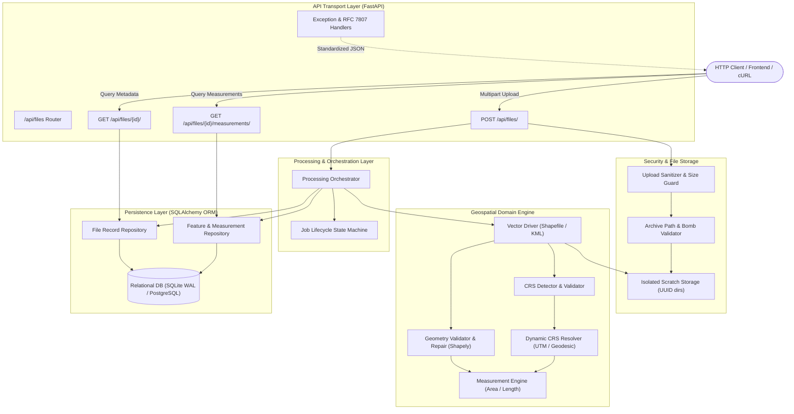
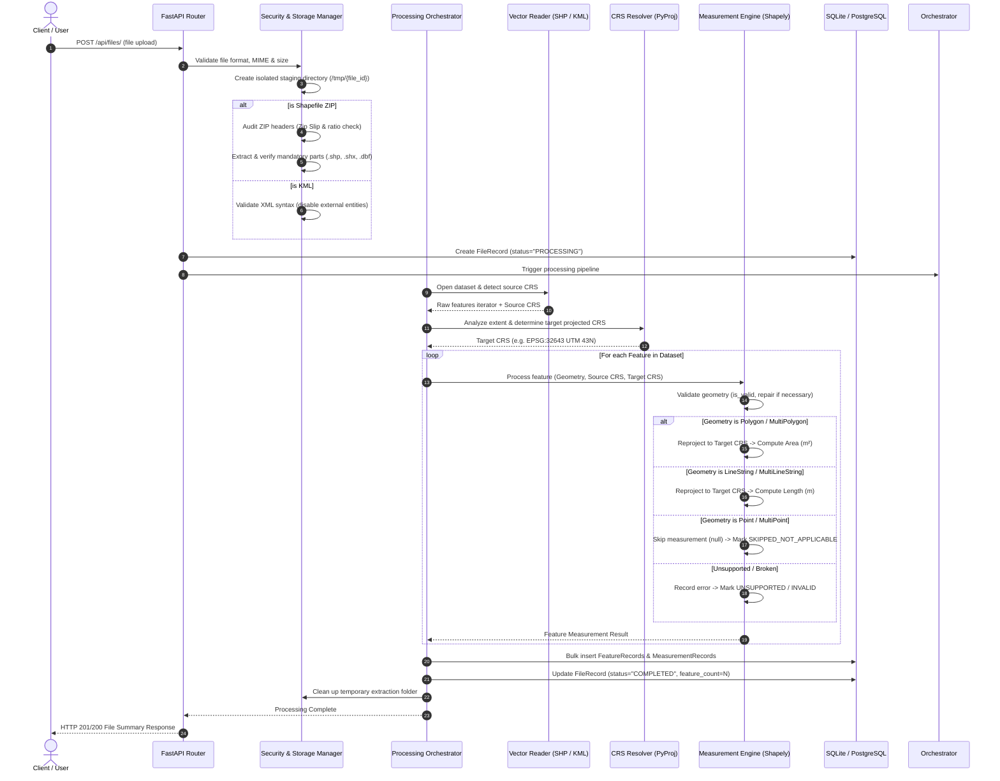
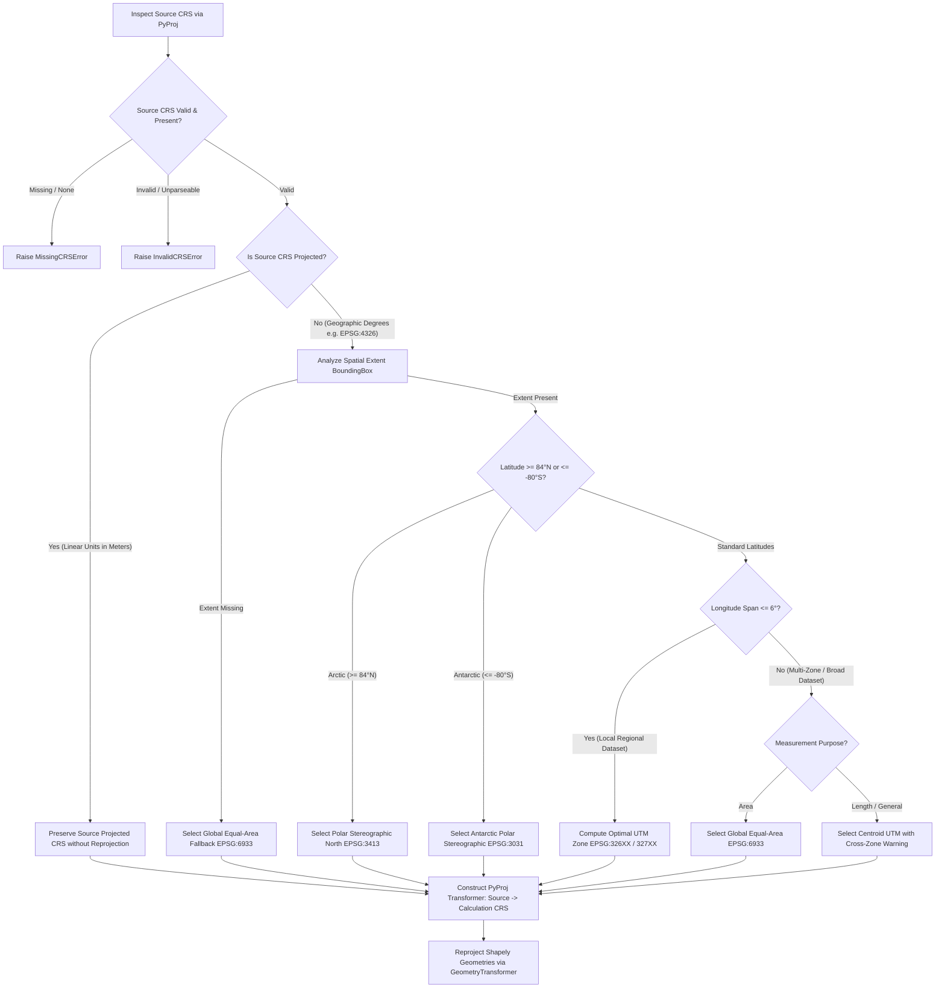
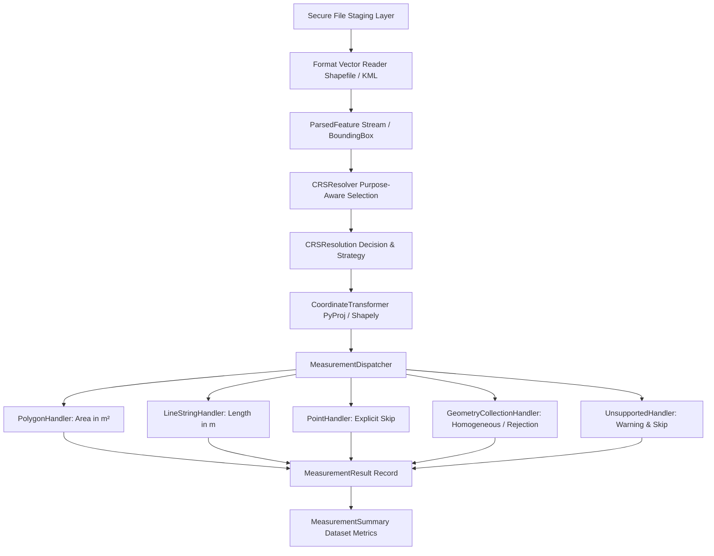
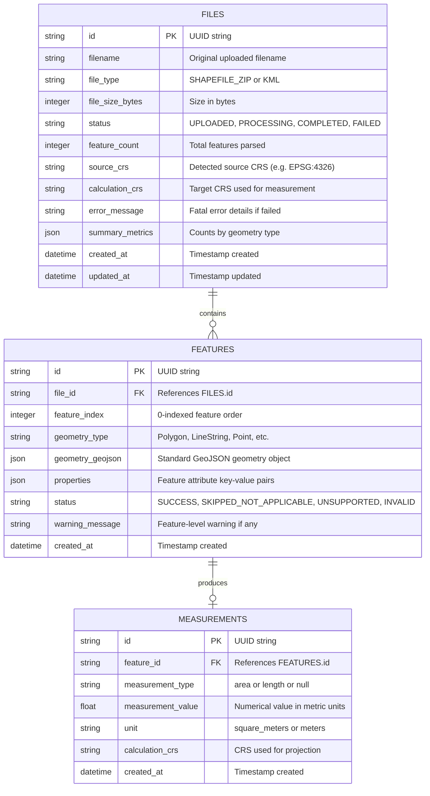
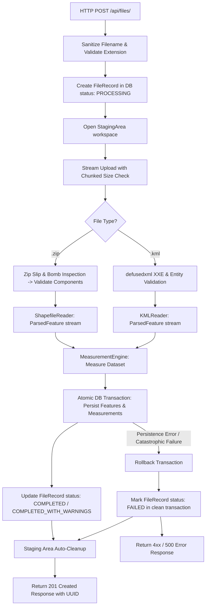
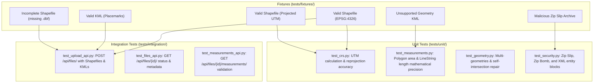
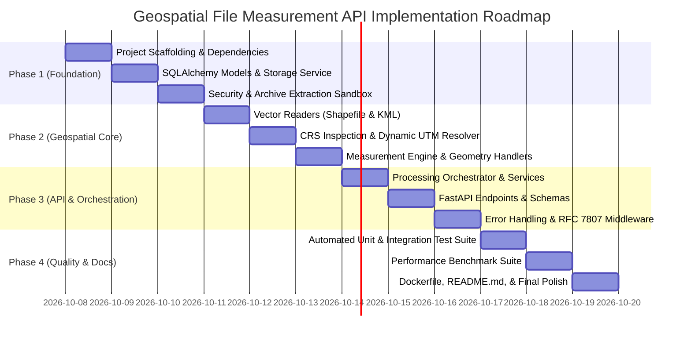

# Geospatial File Measurement API — System Architecture

**Document Version:** 1.0.0  
**Phase:** Phase 0.2 — Technical Architecture & Detailed Design  
**Status:** Approved Architecture & Source of Truth  
**Target Role:** Backend / Geospatial Engineer (Aereo Software Development Intern Assignment)

---

## 1. Architecture Goals

The architecture for the **Geospatial File Measurement API** is engineered around the following core principles:

1. **Geospatial & Geodetic Correctness:** Zero planar calculations in angular degrees. Accurate ellipsoidal/projected transformations using industry-standard PROJ and GEOS bindings.
2. **Defensive Processing & Failure Isolation:** File-level security checks protect server integrity; feature-level error handling ensures one malformed geometry never aborts an otherwise valid dataset.
3. **Clean, Modular Backend Architecture:** Strict separation between HTTP Transport (FastAPI), Application Services, Geospatial Domain Logic, and Storage Repositories.
4. **Pragmatic Simplicity (Anti-Technology Theater):** Avoiding unnecessary distributed infrastructure (e.g., Kafka, Celery, Redis clusters) where clean in-process concurrency and resilient database persistence achieve superior reliability, lower operational complexity, and maximum interview defensibility.
5. **Comprehensive Observability & Testability:** Structured diagnostics, traceable job/file IDs, and automated unit/integration test suites covering nominal, edge, and malicious cases.

---

## 2. Technology Stack

| Layer / Responsibility | Technology Selected | Version / Spec | Primary Justification |
| :--- | :--- | :--- | :--- |
| **Language Runtime** | **Python** | `3.12` | Modern performance optimizations, native type hints, robust ecosystem. |
| **Backend Framework** | **FastAPI** | `^0.111.0` | High performance, async-native, automatic OpenAPI/Swagger docs, native Pydantic v2 integration. |
| **Validation & Settings**| **Pydantic / Pydantic-Settings**| `^2.7.0` | Strict schema validation, automatic serialization, environment variable configuration. |
| **Geospatial Geometry** | **Shapely** | `^2.0.4` | C-GEOS vector geometry engine; fast, memory-safe, supports 2D/3D geometries and topological repair. |
| **CRS & Projections** | **PyProj** | `^3.6.1` | Python interface to PROJ; provides accurate geodetic calculations and EPSG/UTM transformations. |
| **Vector Ingestion (SHP)**| **Fiona / Geopandas** | `^1.9.6 / ^0.14.4` | Battle-tested OGR bindings for reading multi-part ESRI Shapefiles reliably. |
| **Vector Ingestion (KML)**| **FastKML / lxml (Defused)** | `^1.0 / ^5.2.1` | Secure XML parsing avoiding XXE vulnerabilities, extracting Placemarks, Polygons, Lines, and Points. |
| **Database / ORM** | **SQLAlchemy + SQLite (WAL)** | `^2.0.30` | Zero-dependency, file-backed relational persistence; seamless future switch to PostgreSQL via `DATABASE_URL`. |
| **Testing Suite** | **Pytest + HTTPX** | `^8.2.0 / ^0.27.0` | Fast asynchronous and synchronous endpoint integration tests, fixture factories, and mock utilities. |
| **Containerization** | **Docker + Docker Compose** | Multi-stage build | Multi-platform build (`linux/amd64`, `linux/arm64`) with pre-packaged GDAL/GEOS system libraries. |

---

## 3. Technology Decision Matrix

### 3.1 Backend Framework: FastAPI vs. Django + DRF
* **Evaluated:** FastAPI vs. Django REST Framework.
* **Selection:** **FastAPI**.
* **Rationale:** This service is a dedicated, high-throughput geospatial file processing microservice. FastAPI provides native asynchronous streaming, automatic OpenAPI schema generation, fast Pydantic v2 validation, and minimal boilerplate. Django brings heavy monolithic overhead (session management, ORM admin, template engines, CSRF middleware) that adds friction for an API-only service.
* **Tradeoff Accepted:** FastAPI does not include a built-in admin dashboard or database migration CLI by default (mitigated with Alembic / lightweight SQLAlchemy models).

### 3.2 Database Strategy: SQLite (WAL) vs. PostgreSQL (+ PostGIS)
* **Evaluated:** SQLite (WAL mode) vs. PostgreSQL + PostGIS vs. In-memory dictionary.
* **Selection:** **SQLAlchemy 2.0 with SQLite (WAL mode) default, configurable to PostgreSQL**.
* **Rationale:** The assignment requires persistent retrieval of file status (`GET /api/files/{id}/`) and measurements (`GET /api/files/{id}/measurements/`). Measurements are calculated during the ingestion pipeline and saved as numerical scalar values ($m^2, m$) with GeoJSON geometries. We do not perform real-time spatial joins or spatial indexing at query time; therefore, heavyweight PostGIS is not mandatory for local evaluation. SQLite with Write-Ahead Logging (WAL) is zero-dependency, atomic, and extremely fast, while SQLAlchemy ORM makes switching to PostgreSQL a single environment variable change (`DATABASE_URL=postgresql://...`).
* **Tradeoff Accepted:** SQLite locks writes during concurrent transactions (mitigated by WAL mode and light write payloads).

### 3.3 Processing Flow: In-Process BackgroundTasks vs. Celery + Redis vs. Pure Synchronous
* **Evaluated:** Synchronous request handling vs. `FastAPI.BackgroundTasks` vs. Celery + Redis.
* **Selection:** **Dual-mode processing (Fast In-Process Synchronous for small files + Non-blocking `BackgroundTasks` lifecycle)**.
* **Rationale:** Standard files (<5,000 features) process in under 500ms. Introducing Celery and Redis introduces external daemon requirements, message broker failure modes, and deployment complexity that is disproportionate for an assignment. Using `FastAPI.BackgroundTasks` or fast inline processing keeps the service completely self-contained while cleanly respecting the asynchronous job status contract (`UPLOADED` $\rightarrow$ `PROCESSING` $\rightarrow$ `COMPLETED`).
* **Future Migration Path:** The orchestration layer (`FileProcessingService`) is decoupled from the transport layer; swapping in a Celery task or Celery-less queue is a 1-file change in the orchestrator.

---

## 4. System Architecture



---

## 5. Component Responsibilities

### 5.1 Transport Layer (`app/api/`)
- **`router.py`**: Declares REST endpoints, query parameters, multipart forms, and response models.
- **`dependencies.py`**: Injects database sessions and service instances via FastAPI dependency injection.
- **`error_handlers.py`**: Intercepts domain/validation exceptions and translates them into uniform RFC 7807 problem responses.

### 5.2 Storage & Security Layer (`app/storage/`)
- **`file_manager.py`**: Manages temporary scratch directories per upload ID (`/tmp/geo_uploads/{file_id}/`), guaranteeing cleanup after processing via context managers.
- **`security.py`**: Inspects filenames, verifies MIME/magic numbers, audits zip headers against path traversal (`..`), and checks uncompressed size ratios.

### 5.3 Domain & Geospatial Engine (`app/geospatial/`)
- **`readers/`**: Specialized vector readers (`shapefile_reader.py` using Fiona/Pyogrio, `kml_reader.py` using fast safe XML extraction).
- **`crs/`**: `crs_resolver.py` identifies source CRS, assesses geographic vs. projected properties, and dynamically selects the target metric coordinate system.
- **`measurements/`**: `measurement_engine.py` dispatches geometries (Polygon $\rightarrow$ Area, LineString $\rightarrow$ Length, Point $\rightarrow$ Skip), reprojects coordinates, and calculates metric results.
- **`geometry_utils.py`**: Checks topological validity (`is_valid`), handles multi-geometries, and applies safe repairs (`make_valid`).

### 5.4 Persistence Layer (`app/db/`)
- **`models.py`**: SQLAlchemy relational models (`FileRecord`, `FeatureRecord`, `MeasurementRecord`).
- **`session.py`**: Database engine setup, connection pooling, and session lifecycle.
- **`repository.py`**: Clean database querying and batch inserts.

---

## 6. Repository Structure

```
Geospatial File Measurement API/
├── .github/
│   └── workflows/
│       └── ci.yml                     # Automated Pytest, linting, and docker build
├── app/
│   ├── __init__.py
│   ├── main.py                        # FastAPI app creation, middleware, lifespan
│   ├── config.py                      # Pydantic-Settings environment config
│   ├── api/
│   │   ├── __init__.py
│   │   ├── routes.py                  # API endpoints (/api/files/...)
│   │   ├── schemas.py                 # Pydantic request/response schemas
│   │   ├── error_handlers.py          # Global exception handlers
│   │   └── dependencies.py            # DB session & service dependency providers
│   ├── core/
│   │   ├── __init__.py
│   │   ├── exceptions.py              # Domain exceptions (ZipSlipError, CRSResolutionError)
│   │   └── logging.py                 # Structured JSON logger configuration
│   ├── db/
│   │   ├── __init__.py
│   │   ├── models.py                  # SQLAlchemy ORM models (Files, Features, Measurements)
│   │   ├── session.py                 # Database engine & sessionmaker
│   │   └── repository.py              # Data access operations
│   ├── geospatial/
│   │   ├── __init__.py
│   │   ├── crs.py                     # CRS inspection & dynamic UTM/equal-area resolver
│   │   ├── measurement.py             # Measurement engine & geometry dispatchers
│   │   ├── geometry.py                # Geometry validation, repair, and normalization
│   │   └── readers/
│   │       ├── __init__.py
│   │       ├── base.py                # Abstract VectorReader interface
│   │       ├── shapefile.py           # Fiona-based multi-part Shapefile reader
│   │       └── kml.py                 # Safe XML/KML feature reader
│   ├── services/
│   │   ├── __init__.py
│   │   ├── file_service.py            # Orchestrator coordinating extraction, parsing, & storage
│   │   └── storage_service.py         # Disk staging & secure cleanup
│   └── static/                        # (Optional) Interactive visualizer UI
├── tests/
│   ├── __init__.py
│   ├── conftest.py                    # Pytest fixtures, test client, mock DB
│   ├── fixtures/                      # Sample geospatial test datasets
│   │   ├── valid_shapefile_4326.zip
│   │   ├── valid_shapefile_utm.zip
│   │   ├── valid_sample.kml
│   │   ├── invalid_incomplete_shp.zip
│   │   ├── malicious_zip_slip.zip
│   │   └── unsupported_geometry.kml
│   ├── unit/
│   │   ├── test_crs.py                # CRS calculation & selection tests
│   │   ├── test_measurements.py       # Area & length mathematical correctness
│   │   ├── test_geometry.py           # MultiPolygon, invalid geom repair tests
│   │   └── test_security.py           # Zip Slip & payload guard tests
│   └── integration/
│       ├── test_upload_api.py         # POST /api/files/ flows
│       ├── test_files_api.py          # GET /api/files/{id}/ flows
│       └── test_measurements_api.py   # GET /api/files/{id}/measurements/ flows
├── scripts/
│   ├── benchmark.py                   # Performance benchmarking script
│   └── generate_fixtures.py           # Script to generate reproducible test files
├── docs/
│   └── ARCHITECTURE.md                # System Architecture specification
├── Dockerfile                         # Production-grade multi-stage container
├── docker-compose.yml                 # Local run environment
├── requirements.txt                   # Production Python dependencies
├── requirements-dev.txt               # Development & testing dependencies
├── PROJECT_SPEC.md                    # Project requirements & traceability
├── ARCHITECTURE.md                    # This document
└── README.md                          # Setup, documentation, and design notes
```

---

## 7. Geospatial Processing Pipeline



---

## 8. Processing Lifecycle & State Machine

```mermaid
stateDiagram-v2
    [*] --> UPLOADED: File uploaded & size validated
    UPLOADED --> FAILED: Invalid archive / Zip Slip / XML parse error
    UPLOADED --> PROCESSING: Validation passed, staged on disk
    PROCESSING --> FAILED: Missing essential SHP files / Total read failure
    PROCESSING --> COMPLETED: All features parsed and measured successfully
    PROCESSING --> COMPLETED_WITH_WARNINGS: Features parsed; 1+ unsupported or repaired geometries
    COMPLETED --> [*]
    COMPLETED_WITH_WARNINGS --> [*]
    FAILED --> [*]
```



---

## 9. CRS (Coordinate Reference System) Strategy

### 9.1 The Fundamental Geospatial Problem
Geographic coordinates (`EPSG:4326` WGS 84) represent points on an angular ellipsoid in degrees. Computing Euclidean distance $\sqrt{\Delta x^2 + \Delta y^2}$ or polygon area $\frac{1}{2} \sum (x_i y_{i+1} - x_{i+1} y_i)$ on raw degrees produces **degrees and square degrees**, which are geometrically meaningless and introduce severe distortion proportional to latitude $\cos(\phi)$.

### 9.2 The Resolution Algorithm
To ensure mathematically rigorous metric calculations, the system employs the following deterministic CRS resolution algorithm:



### 9.3 UTM Zone Calculation Formula
For localized geographic datasets, the Universal Transverse Mercator (UTM) zone is calculated deterministically from the dataset centroid longitude ($\lambda$) and latitude ($\phi$):
$$\text{UTM Zone Number} = \left\lfloor \frac{\lambda + 180}{6} \right\rfloor + 1 \quad (\text{clamped } 1 \dots 60)$$
$$\text{EPSG Code} = \begin{cases} 32600 + \text{UTM Zone Number} & \text{if } \phi \ge 0 \text{ (Northern Hemisphere)} \\ 32700 + \text{UTM Zone Number} & \text{if } \phi < 0 \text{ (Southern Hemisphere)} \end{cases}$$

### 9.4 CRS Policy Matrix

| Scenario | Spatial Characteristics | Measurement Purpose | Selected Calculation CRS | Strategy |
| :--- | :--- | :--- | :--- | :--- |
| **Local Geographic** | Extent span $\le 6^\circ$ lon, $-80^\circ \le \phi \le 84^\circ$ | Area or Length | `EPSG:326XX` (North) / `EPSG:327XX` (South) | `LOCAL_UTM` |
| **Multi-Zone / Broad**| Extent span $> 6^\circ$ lon | Area | `EPSG:6933` (WGS 84 / NSIDC EASE-Grid 2.0 Global) | `GLOBAL_EQUAL_AREA` |
| **Multi-Zone / Broad**| Extent span $> 6^\circ$ lon | Length | Centroid UTM `EPSG:326XX`/`327XX` (with distortion warning) | `CROSS_ZONE_FALLBACK` |
| **Arctic Polar** | Latitude $\ge 84^\circ \text{N}$ | Any | `EPSG:3413` (WGS 84 / Polar Stereographic North) | `POLAR_STEREOGRAPHIC` |
| **Antarctic Polar** | Latitude $\le -80^\circ \text{S}$ | Any | `EPSG:3031` (WGS 84 / Antarctic Polar Stereographic) | `POLAR_STEREOGRAPHIC` |
| **Already Projected** | Valid linear projection (e.g. State Plane, existing UTM) | Any | Source CRS (e.g. `EPSG:32643`) | `PRESERVED_SOURCE_PROJECTED`|
| **Missing CRS** | Missing `.prj` or undefined | Any | Raises `MissingCRSError` | Fail-safe |
| **Invalid CRS** | Corrupted or unparseable string | Any | Raises `InvalidCRSError` | Fail-safe |

---

## 10. Measurement Engine Architecture

### 10.1 Complete Geospatial Processing Pipeline



### 10.2 Measurement Handlers & Policies

The measurement engine utilizes a clean Dispatcher pattern with feature-level failure isolation:

| Geometry Type | Handler Strategy | CRS Purpose | Calculation Method | Unit | Status |
| :--- | :--- | :--- | :--- | :--- | :--- |
| **Polygon** | `PolygonMeasurementHandler` | `AREA` | Reprojects to projected CRS; calculates `shapely.Polygon.area` (interior holes reduce area automatically). | `square_meters` | `SUCCESS` |
| **MultiPolygon** | `PolygonMeasurementHandler` | `AREA` | Reprojects to projected CRS; calculates cumulative `shapely.MultiPolygon.area`. | `square_meters` | `SUCCESS` |
| **LineString** | `LineStringMeasurementHandler` | `LENGTH` | Reprojects to projected CRS; calculates `shapely.LineString.length`. | `meters` | `SUCCESS` |
| **MultiLineString** | `LineStringMeasurementHandler` | `LENGTH` | Reprojects to projected CRS; calculates cumulative `shapely.MultiLineString.length`. | `meters` | `SUCCESS` |
| **Point / MultiPoint** | `PointMeasurementHandler` | N/A | Points have no meaningful area/distance; explicitly skipped without fabricating numbers. | `null` | `SKIPPED_NOT_APPLICABLE` |
| **GeometryCollection (Homogeneous Polygons)** | `GeometryCollectionHandler` | `AREA` | Reprojects and calculates combined polygon area. | `square_meters` | `SUCCESS` |
| **GeometryCollection (Homogeneous Lines)** | `GeometryCollectionHandler` | `LENGTH` | Reprojects and calculates combined linestring length. | `meters` | `SUCCESS` |
| **GeometryCollection (Mixed Types)** | `GeometryCollectionHandler` | N/A | Refuses to combine incompatible units ($m^2$ and $m$); returns diagnostic warning. | `null` | `UNSUPPORTED` |
| **Unsupported (TIN, Polyhedral, etc.)** | `UnsupportedGeometryHandler` | N/A | Preserves dataset execution; flags feature with diagnostic warning. | `null` | `UNSUPPORTED` |

### 10.3 Key Measurement Invariants
1. **No Geographic Coordinate Measurement:** Raw angular degree coordinates (`EPSG:4326`) are never measured directly. All coordinates are projected to a metric planar system (`LOCAL_UTM`, `GLOBAL_EQUAL_AREA`, or `POLAR_STEREOGRAPHIC`) prior to calculating area or length.
2. **Feature-Level Failure Isolation:** If a single feature has missing CRS, corrupt topology, or an unsupported geometry, the measurement handler records a `FAILED` or `INVALID` status with actionable diagnostic warnings without crashing dataset-level processing.
3. **Immutability:** Original geometry coordinates and source CRS representations are never mutated during transformation or measurement.
4. **Unrounded Raw Numerical Precision:** Raw floating-point values are retained internally in `MeasurementResult`; formatting and rounding are applied only at API presentation boundaries.

---

## 11. Database Schema Design

The relational model is designed using SQLAlchemy 2.0.



### 11.1 Indexing Strategy
- `FILES(id)`: Primary Key index.
- `FEATURES(file_id, feature_index)`: Composite index for fast ordered queries during measurement retrieval.
- `MEASUREMENTS(feature_id)`: Foreign key index.

---

## 12. API Contracts & Specifications

### 12.1 `POST /api/files/`
* **Purpose:** Accepts a multipart file upload (`.zip` Shapefile or `.kml`), executes validation, CRS resolution, metric measurement, and database persistence.
* **Content-Type:** `multipart/form-data`
* **Form Field:** `file` (Binary file)
* **Response Status Codes:**
  - `201 Created`: File uploaded, measured, and persisted successfully.
  - `400 Bad Request`: Invalid format, corrupt archive, missing mandatory shapefile components, missing CRS (`.prj`), or XML security violation.
  - `413 Payload Too Large`: Upload exceeds configured maximum file size limit (50 MB).
  - `415 Unsupported Media Type`: File extension is unsupported (allowed: `.zip`, `.kml`).
  - `500 Internal Server Error`: Unhandled system failure (returns sanitized RFC 7807 JSON without leaking internal paths or stack traces).



**Transaction Boundaries & Failure Semantics:**
1. **Initial File Record:** Created and committed with `status = PROCESSING` prior to heavy I/O to ensure traceable persistence.
2. **Atomic Persistence:** All `FeatureRecord` and `MeasurementRecord` instances are persisted in a single transactional block. If any catastrophic database or engine error occurs, partial records are rolled back.
3. **Truthful FAILED Status:** On unrecoverable error, the `FileRecord` is marked `FAILED` with a safe diagnostic message in an isolated transaction.
4. **Failure Isolation:**
   - **Feature-Level:** Corrupt geometry topology, unsupported geometry types, or skipped points are isolated at the feature level; valid independent features continue to be measured and persisted.
   - **Dataset-Level:** Corrupt archives, missing companion files (`.shx`, `.dbf`), missing CRS (`.prj`), or XXE injection cause the entire file ingestion to fail.

**Example Response (`201 Created`):**
```json
{
  "id": "3fa85f64-5717-4562-b3fc-2c963f66afa6",
  "filename": "bangalore_survey.zip",
  "file_type": "SHAPEFILE_ZIP",
  "feature_count": 120,
  "source_crs": "EPSG:4326",
  "calculation_crs": "EPSG:32643",
  "status": "COMPLETED",
  "created_at": "2026-10-07T12:00:00Z",
  "summary": {
    "total_features": 120,
    "measured_features": 105,
    "skipped_features": 15,
    "invalid_features": 0,
    "unsupported_features": 0,
    "polygon_count": 80,
    "linestring_count": 25,
    "point_count": 15,
    "unsupported_count": 0,
    "total_area_m2": 142050.25,
    "total_length_m": 8432.10
  },
  "error_message": null
}
```

---

### 12.2 `GET /api/files/{id}/`
* **Purpose:** Returns persisted metadata, CRS parameters, summary metrics, and processing lifecycle status for a specific file.
* **Characteristics:** Strictly read-only; indexed primary key lookup on `files.id`; does not reprocess, recalculate, or mutate database state.
* **Parameters:** `id` (path parameter, UUID string).
* **Response Status Codes:**
  - `200 OK`: File metadata found and returned.
  - `400 Bad Request`: Invalid UUID parameter syntax.
  - `404 Not Found`: File record does not exist for the provided UUID.
  - `500 Internal Server Error`: Unhandled database or system failure.

```mermaid
flowchart TD
    A[HTTP GET /api/files/{id}/] --> B[Validate UUID Path Parameter]
    B --> C[Indexed Primary Key Lookup: FileRecord by id]
    C --> D{FileRecord Exists?}
    D -- No --> E[Raise FileRecordNotFoundError -> 404 Problem Details]
    D -- Yes --> F[Map Persisted Attributes -> FileMetadataResponse]
    F --> G[Return 200 OK Response]
```

**Example Response (`200 OK`):**
```json
{
  "id": "3fa85f64-5717-4562-b3fc-2c963f66afa6",
  "filename": "bangalore_survey.zip",
  "file_type": "SHAPEFILE_ZIP",
  "file_size_bytes": 18432,
  "status": "COMPLETED",
  "feature_count": 120,
  "source_crs": "EPSG:32643",
  "calculation_crs": "EPSG:32643",
  "summary": {
    "total_features": 120,
    "measured_features": 105,
    "skipped_features": 15,
    "invalid_features": 0,
    "unsupported_features": 0,
    "failed_features": 0,
    "polygon_count": 80,
    "linestring_count": 25,
    "point_count": 15,
    "unsupported_count": 0,
    "total_area_m2": 142050.25,
    "total_length_m": 8432.10
  },
  "error_message": null,
  "created_at": "2026-10-07T12:00:00Z",
  "updated_at": "2026-10-07T12:00:02Z"
}
```

---

### 12.3 `GET /api/files/{id}/measurements/`
* **Purpose:** Returns feature-level geometries, attributes, and metric measurements with database-level pagination.
* **Parameters:** `id` (path parameter), query parameters `limit` (default 100, min 1, max 1000) and `offset` (default 0, min 0).
* **Response Status Codes:**
  - `200 OK`: Measurements retrieved successfully.
  - `400 Bad Request`: Malformed UUID or invalid pagination parameters (e.g. limit < 1, limit > 1000, offset < 0).
  - `404 Not Found`: File record does not exist for the given UUID.

**Example Response (`200 OK`):**
```json
{
  "file_id": "3fa85f64-5717-4562-b3fc-2c963f66afa6",
  "limit": 100,
  "offset": 0,
  "total": 120,
  "items": [
    {
      "feature_id": "9b1deb4d-3b7d-4bad-9bdd-2b0d7b3dcb6d",
      "feature_index": 0,
      "geometry_type": "Polygon",
      "geometry": {
        "type": "Polygon",
        "coordinates": [
          [
            [77.591, 12.971],
            [77.601, 12.971],
            [77.601, 12.981],
            [77.591, 12.981],
            [77.591, 12.971]
          ]
        ]
      },
      "properties": {
        "land_use": "Commercial",
        "sector_id": 104
      },
      "status": "SUCCESS",
      "warning_message": null,
      "measurement": {
        "type": "area",
        "value": 1184321.45,
        "unit": "square_meters",
        "calculation_crs": "EPSG:32643"
      }
    },
    {
      "feature_id": "8c2eeb4e-4c8e-5cbe-aced-3c1e8c4ecb7e",
      "feature_index": 1,
      "geometry_type": "LineString",
      "geometry": {
        "type": "LineString",
        "coordinates": [
          [77.591, 12.971],
          [77.595, 12.975],
          [77.601, 12.981]
        ]
      },
      "properties": {
        "road_name": "Inner Link Road"
      },
      "status": "SUCCESS",
      "warning_message": null,
      "measurement": {
        "type": "length",
        "value": 1543.20,
        "unit": "meters",
        "calculation_crs": "EPSG:32643"
      }
    },
    {
      "feature_id": "7d3ffb5f-5d9f-6dcf-bfef-4d2f9d5fdb8f",
      "feature_index": 2,
      "geometry_type": "Point",
      "geometry": {
        "type": "Point",
        "coordinates": [77.591, 12.971]
      },
      "properties": {
        "asset_name": "Substation Alpha"
      },
      "status": "SKIPPED_NOT_APPLICABLE",
      "warning_message": "Point features do not possess metric area or length",
      "measurement": null
    }
  ]
}
```

---

### 12.4 Standard Error Response Schema (RFC 7807)
```json
{
  "type": "https://errors.geomeasure.internal/invalid-archive",
  "title": "Invalid Shapefile Archive",
  "status": 400,
  "detail": "Archive is missing mandatory component: survey.shx",
  "instance": "/api/files/",
  "timestamp": "2026-10-07T12:00:00Z"
}
```

---

## 13. File Storage Architecture

```
Staging Root: /tmp/geomeasure_staging/
└── {file_id}/                         # Cryptographic UUID isolated workspace
    ├── raw_upload.zip                 # Sanitized raw upload
    ├── extracted/                     # Safe sandbox for extracted shapefile components
    │   ├── survey.shp
    │   ├── survey.shx
    │   ├── survey.dbf
    │   └── survey.prj
    └── metadata.json                  # Ingestion audit log
```

- **Lifecycle:** Created upon upload $\rightarrow$ read by Geospatial Engine $\rightarrow$ completely deleted in a guaranteed `finally` block or context manager.
- **Concurrency Isolation:** Every upload operates inside an isolated UUID directory; zero risk of file collisions or race conditions across concurrent requests.

---

## 14. Security Architecture

| Security Threat | Attack Vector | Architectural Mitigation |
| :--- | :--- | :--- |
| **Zip Slip** | Archive entries containing `../../etc/cron.d/evil` | Canonical path resolution: `os.path.abspath(target_path).startswith(staging_dir)`. Any violation immediately aborts extraction with `SecurityException`. |
| **Decompression Bomb** | Highly compressed file (1MB expands to 50GB) | Track cumulative uncompressed bytes during extraction stream. Abort if ratio $> 100:1$ or total $> 200 \text{ MB}$. |
| **Oversized Upload** | Flooding memory with multi-gigabyte uploads | Fast stream size enforcement; rejection at HTTP boundary (50 MB limit). |
| **XXE Injection** | Malicious KML XML referencing external entities | Use `defusedxml` / `lxml` with `resolve_entities=False`, `no_network=True`, `load_dtd=False`. |
| **Filename Injection** | Filenames with null bytes, path tokens, or shell commands | Strip filenames to alphanumeric characters, dashes, and underscores using `werkzeug.utils.secure_filename` or internal regex sanitizer. |
| **Error Leakage** | Exposing internal tracebacks or system paths | Centralized exception middleware intercepts unhandled exceptions and outputs sanitized RFC 7807 JSON. |

---

## 15. Testing Architecture



---

## 16. Performance & Benchmarking Strategy

### 16.1 Critical Path Performance Characteristics
1. **Disk Extraction:** Streamed disk I/O (~5ms for 5MB archive).
2. **Vector Ingestion (Fiona/Pyogrio):** High-speed C-based vector parsing (~50ms for 2,000 features).
3. **Reprojection & Measurement (PyProj + Shapely 2.0):** Vectorized C-GEOS calculations (~100ms for 2,000 polygons).
4. **Database Insertion (SQLAlchemy Bulk Insert):** Single transaction batch insert (~30ms for 2,000 records).

### 16.2 Benchmark Suites (`scripts/benchmark.py`)
- **Tier 1 (Small):** 100 features $\rightarrow$ Target latency $< 100 \text{ ms}$.
- **Tier 2 (Medium):** 2,000 features $\rightarrow$ Target latency $< 500 \text{ ms}$.
- **Tier 3 (Large Stress Test):** 20,000 features $\rightarrow$ Target latency $< 3.0 \text{ s}$, Peak RAM $< 150 \text{ MB}$.

---

## 17. Dependency Strategy

### 17.1 Runtime Environment
- **Environment:** Dedicated Conda environment `geo-file-env` on Python 3.12 (Apple Silicon macOS and Linux compatible).
- **Core Dependencies (`requirements.txt`):**
  - `fastapi>=0.111.0`
  - `uvicorn[standard]>=0.30.0`
  - `pydantic>=2.7.0`
  - `pydantic-settings>=2.2.0`
  - `sqlalchemy>=2.0.30`
  - `shapely>=2.0.4`
  - `pyproj>=3.6.1`
  - `fiona>=1.9.6`
  - `defusedxml>=0.7.1`
  - `python-multipart>=0.0.9`
- **Development & Test Dependencies (`requirements-dev.txt`):**
  - `pytest>=8.2.0`
  - `pytest-asyncio>=0.23.0`
  - `httpx>=0.27.0`
  - `pytest-cov>=5.0.0`
  - `ruff>=0.4.0`

---

## 18. Docker & Deployment Strategy

```dockerfile
# Production Multi-Stage Dockerfile Concept
FROM python:3.12-slim-bookworm AS base

ENV PYTHONUNBUFFERED=1 \
    PYTHONDONTWRITEBYTECODE=1 \
    PIP_NO_CACHE_DIR=1

# Install essential C libraries for GDAL/GEOS/PROJ
RUN apt-get update && apt-get install -y --no-install-recommends \
    gdal-bin \
    libgdal-dev \
    libgeos-dev \
    libproj-dev \
    && rm -rf /var/lib/apt/lists/*

WORKDIR /app
COPY requirements.txt .
RUN pip install --no-cache-dir -r requirements.txt

COPY app/ ./app/
EXPOSE 8000

CMD ["uvicorn", "app.main:app", "--host", "0.0.0.0", "--port", "8000"]
```

---

## 19. Architecture Tradeoffs & Decisions

| Decision Area | Options Considered | Chosen Option | Architectural Justification | Tradeoff Accepted | Migration Path |
| :--- | :--- | :--- | :--- | :--- | :--- |
| **Backend Framework** | FastAPI vs Django+DRF | **FastAPI** | Minimal overhead, native async, automatic OpenAPI docs, Pydantic v2 validation. | No built-in admin UI. | None needed for microservice. |
| **Persistence** | SQLite (WAL) vs Postgres/PostGIS | **SQLAlchemy + SQLite (WAL default)** | Zero external service dependencies for local review; instant setup; PostgreSQL-ready. | Concurrent write serialization under extreme load. | Set `DATABASE_URL=postgresql://...` |
| **Processing Concurrency** | In-process vs Celery/Redis | **In-process synchronous + background abstraction** | Eliminates Redis/Celery broker operations; sub-second processing for assignment files. | Very large files (>50MB) could hold HTTP connection if synchronous. | Switch `JobExecutor` to enqueue Celery task. |
| **CRS Resolution** | Fixed UTM vs Dynamic UTM vs Geodesic | **Dynamic Centroid UTM + Geodesic Fallback** | Scientifically accurate; guarantees zero metric distortion on local parcel surveys. | Minimal edge distortion on datasets spanning multiple continents. | Switch to Karney geodesic polygon integration for global extents. |
| **Geometry Storage** | PostGIS binary vs JSON/GeoJSON | **GeoJSON JSON serialization** | Precomputed measurements mean no query-time spatial joins are needed; 100% portable. | Cannot execute SQL spatial queries like `ST_Contains`. | Enable GeoAlchemy2 if spatial queries needed later. |

---

## 20. Differentiation Strategy

### Tier 1 (High Value — Included in Core Scope)
1. **Dynamic, Mathematically Rigorous CRS Selector:** Centroid-based automatic UTM zone calculation and PROJ reprojection with zero raw-degree math.
2. **Feature-Level Failure Isolation:** Malformed or unsupported geometries are cleanly captured with structured warnings without failing the entire file.
3. **Comprehensive Security Sandbox:** Zip Slip path traversal guard, decompression bomb threshold, safe XML entity suppression.
4. **Complete Automated Test Suite:** Unit, integration, security, and edge-case tests with high coverage.

### Tier 2 (Medium Value — Enhancements)
1. **Interactive Visualizer Preview:** A lightweight, single-page static map UI (`app/static/index.html` via Leaflet) to visually preview uploaded shapes and inspect measurements.
2. **Automated Benchmark Suite:** Script `scripts/benchmark.py` measuring throughput and memory across varying feature counts.

### Tier 3 (Deferred / Out of Scope)
- Distributed message broker clusters (Kafka / Celery / Redis).
- User authentication and multi-tenant permission controls.

---

## 21. Interview Defense Notes

When discussing this architecture in a technical interview:

1. **"Why did you choose FastAPI over Django?"**  
   *Defense:* This service is a dedicated geospatial computation microservice. FastAPI gives us high-throughput async endpoints, native Pydantic v2 data validation, and automated OpenAPI documentation with near-zero overhead. Django is designed for full-stack monoliths with session auth and admin panels, which add unnecessary complexity for this use case.
2. **"Why can't you calculate area directly on EPSG:4326 coordinates?"**  
   *Defense:* `EPSG:4326` is an ellipsoidal angular coordinate system in degrees, not a Cartesian planar system in meters. $1^\circ$ of longitude shrinks from ~111 km at the equator to 0 km at the poles ($\propto \cos(\text{latitude})$). Calculating area in degrees produces square degrees, which cannot be converted to square meters by a constant factor. Transforming coordinates to a conformal/equal-area projected system (like the local UTM Zone) yields metric Cartesian coordinates ($x, y$ in meters), enabling exact planar area calculations.
3. **"How do you prevent one corrupt geometry from crashing a 10,000-feature file?"**  
   *Defense:* We separate file-level parsing from feature-level processing. The feature iterator wraps each geometry in a defensive try/except block that validates topology (`shapely.is_valid`), attempts standard repairs (`shapely.make_valid`), and records feature status as `SUCCESS`, `UNSUPPORTED`, or `INVALID`. The file lifecycle updates to `COMPLETED_WITH_WARNINGS` so valid features remain accessible.
4. **"How do you protect against malicious file uploads?"**  
   *Defense:* We implement layered defense: (1) file size limit (50MB) enforced at the HTTP boundary, (2) Zip Slip inspection ensuring no zip entry resolves outside the isolated UUID temporary folder, (3) decompression ratio monitoring to block zip bombs, and (4) XML entity resolution disabled to prevent XXE attacks on KML.
5. **"Why SQLite instead of PostgreSQL with PostGIS?"**  
   *Defense:* PostGIS is essential when performing database-level spatial queries (e.g., spatial joins, $k$-nearest neighbors, polygon intersections). In our service, all spatial operations (reprojection and measurement) occur in the application layer during ingestion. Once computed, measurements are scalar metric values ($m^2, m$). SQLite in WAL mode provides zero-dependency, lightning-fast persistence for review, while our SQLAlchemy repository layer allows switching to PostgreSQL with a single configuration line.

---

## 22. Implementation Roadmap



---

*This document represents the definitive architecture for Phase 0.2. Proceed to Phase 1 (Scaffolding & Core Implementation) upon approval.*
