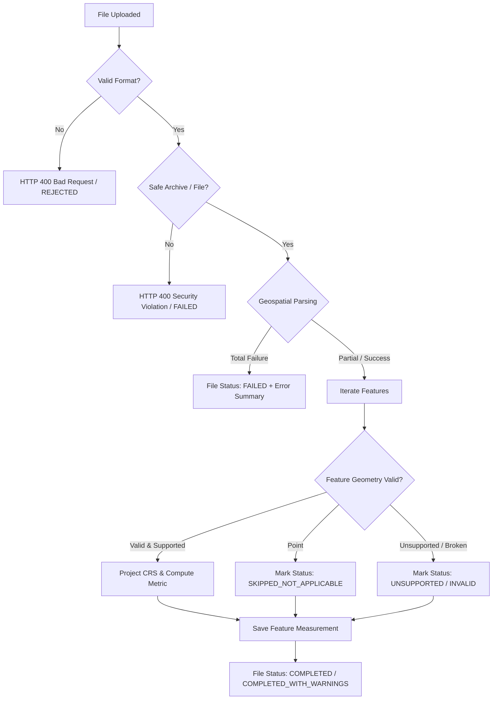
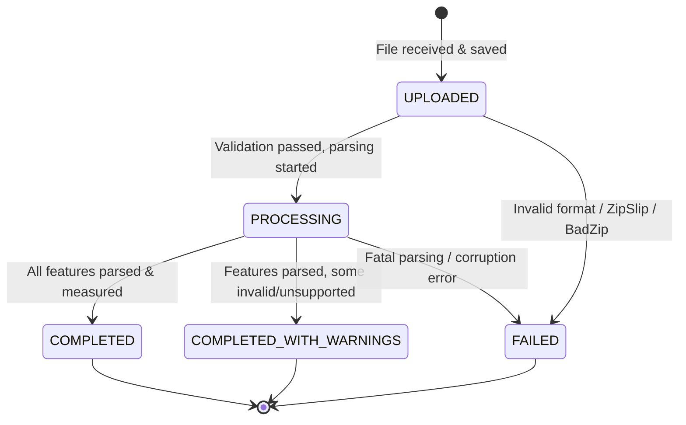

# Geospatial File Measurement API — Project Engineering Specification

**Document Version:** 1.0.0  
**Phase:** Phase 0.1 — Reverse Engineering & Engineering Specification  
**Status:** Approved Specification / Source of Truth  
**Target Role:** Backend / Geospatial Engineer (Aereo Software Development Intern Assignment)

---

## 1. Project Overview

### 1.1 Problem Statement
The objective of this project is to build a robust, production-grade backend service (using Python with FastAPI or Django REST Framework) that accepts user-uploaded geospatial vector files (specifically Shapefile archives in `.zip` format and Keyhole Markup Language `.kml` files), ingests and parses their geographic features, inspects CRS (Coordinate Reference System) metadata, projects geometries to appropriate planar reference systems, calculates metric measurements (Polygon Area in $m^2$, LineString Length in $m$), gracefully handles non-measurable or unsupported geometries (e.g., Points, GeometryCollections), and serves the structured inspection and measurement results via RESTful API endpoints.

### 1.2 Evaluation Context & Engineering Goals
The assignment evaluates:
1. **Clean Backend Architecture:** Predictable routing, schema validation, failure containment, modular separation of concerns, and clean lifecycle management.
2. **Geospatial Rigor:** Correct spatial awareness, geodesic vs. planar projection understanding, accurate CRS reprojection, and unit-accurate geodesy.
3. **Robust File Processing & Security:** Safe archive extraction, defense against malicious payloads (Zip Slip, decompression bombs), temporary file cleanup, and defensive schema parsing.
4. **Production Code Quality:** High unit/integration test coverage, structured logging/observability, clear API contracts, and interview-defensible engineering decisions.

---

## 2. Assignment Requirements

Extracted from the official specification document (`Geospatial File Measurement API.docx.pdf`):

| Category | Requirement Ref | Explicit Assignment Requirement |
| :--- | :--- | :--- |
| **Framework** | `REQ-FW-01` | Build backend using either **FastAPI** or **Django + Django REST Framework**. |
| **File Ingestion** | `REQ-UP-01` | Provide an endpoint `POST /api/files/` accepting geospatial file uploads. |
| **File Formats** | `REQ-UP-02` | Accept `.zip` containing a Shapefile (requiring valid component files). |
| **File Formats** | `REQ-UP-03` | Accept `.kml` vector files. |
| **Feature Extraction** | `REQ-PR-01` | Read geospatial data and extract individual features. |
| **Feature Extraction** | `REQ-PR-02` | For every feature, identify at minimum: **Feature ID/Index**, **Geometry Type**, **Geometry**, **CRS**, and **Properties/Attributes**. |
| **Geometry Handling**| `REQ-PR-03` | If a geometry type is not supported for measurement calculation, handle it gracefully rather than crashing. |
| **Measurement** | `REQ-MS-01` | Calculate **Area** for `Polygon` geometries. |
| **Measurement** | `REQ-MS-02` | Calculate **Length** for `LineString` geometries. |
| **Measurement** | `REQ-MS-03` | Handle `Point` geometries without calculating a measurement (no measurement required). |
| **CRS Handling** | `REQ-CRS-01` | Correctly handle geographic coordinate systems (e.g., `EPSG:4326` WGS 84). |
| **CRS Handling** | `REQ-CRS-02` | **Do not directly calculate area or distance using latitude/longitude degrees.** |
| **CRS Handling** | `REQ-CRS-03` | Transform geometries to an appropriate projected coordinate system prior to measurement calculation. |
| **API Endpoints** | `REQ-API-01` | `POST /api/files/`: Uploads and processes a file. |
| **API Endpoints** | `REQ-API-02` | `GET /api/files/{id}/`: Returns file metadata (id, filename, feature count, CRS, processing status). |
| **API Endpoints** | `REQ-API-03` | `GET /api/files/{id}/measurements/`: Returns feature-level measurements and attributes. |
| **Documentation** | `REQ-DOC-01` | `README.md` covering local setup, complete API request/response docs, architecture (structure, file flow, measurement flow, CRS flow), and design decisions. |
| **Submission** | `REQ-SUB-01` | Public GitHub repository containing source code, learnings, and future scope. |

---

## 3. Requirements Traceability Matrix

| Requirement | Source Document | Priority | Planned Implementation Area | Planned Test Suite | Status |
| :--- | :--- | :--- | :--- | :--- | :--- |
| `REQ-FW-01` (Framework) | Assignment Sec. 1 | P0 | Project Core / Application Entrypoint | Framework startup & health tests | Pending Phase 0.2 Decision |
| `REQ-UP-01` (Upload API) | Assignment Sec. 2 & 6 | P0 | Routing (`/api/files/`), File Handler | Integration test: file upload & ingestion | Pending Implementation |
| `REQ-UP-02` (Shapefile .zip) | Assignment Sec. 2 | P0 | Archive Ingestion & Shp Parser | Unit & integration tests on multi-part .shp.zip | Pending Implementation |
| `REQ-UP-03` (KML file) | Assignment Sec. 2 | P0 | KML Parser & XML sanitizer | Unit & integration tests on standard .kml | Pending Implementation |
| `REQ-PR-01` (Extract Features) | Assignment Sec. 3 | P0 | Geospatial Parsing Pipeline | Vector parsing unit tests | Pending Implementation |
| `REQ-PR-02` (Feature Metadata) | Assignment Sec. 3 | P0 | Domain Schema (ID, Type, Geom, CRS, Props) | Schema serialization & validation tests | Pending Implementation |
| `REQ-PR-03` (Graceful Fallback)| Assignment Sec. 3 | P0 | Feature-level error wrapper & handler | Tests with mixed / unsupported geometries | Pending Implementation |
| `REQ-MS-01` (Polygon Area) | Assignment Sec. 4 | P0 | Measurement Engine (Planar Reprojection) | Precision verification tests against known areas | Pending Implementation |
| `REQ-MS-02` (LineString Length)| Assignment Sec. 4 | P0 | Measurement Engine (Planar Reprojection) | Precision verification tests against known lengths | Pending Implementation |
| `REQ-MS-03` (Point handling) | Assignment Sec. 4 | P0 | Measurement Engine (Point Dispatcher) | Tests confirming Point results with null measure | Pending Implementation |
| `REQ-CRS-01` (Geographic CRS) | Assignment Sec. 5 | P0 | CRS Inspector & Normalizer | Tests with EPSG:4326 files | Pending Implementation |
| `REQ-CRS-02` (No Degree Math) | Assignment Sec. 5 | P0 | Measurement Pipeline assertion | Unit test proving degree math rejection | Pending Implementation |
| `REQ-CRS-03` (Projected Reprojection)| Assignment Sec. 5 | P0 | Dynamic CRS Selection & Reprojection Engine | Spatial reference validation & reprojection tests | Pending Phase 0.2 Decision |
| `REQ-API-01` (Upload Endpoint)| Assignment Sec. 6 | P0 | File Controller / Router | HTTP 201/200 Contract tests | Pending Implementation |
| `REQ-API-02` (File Details) | Assignment Sec. 6 | P0 | Query Service / Router | HTTP 200/404 Contract tests | Pending Implementation |
| `REQ-API-03` (Measurements) | Assignment Sec. 6 | P0 | Query Service / Router | HTTP 200/404 Payload validation tests | Pending Implementation |
| `REQ-DOC-01` (README & Docs) | Assignment Sec. 7 | P0 | `README.md`, `ARCHITECTURE.md`, OpenAPI Docs | Documentation linting & completeness review | Pending Implementation |
| `REQ-SUB-01` (Submission) | Assignment Sec. 8 | P0 | Git Repository & GitHub Actions | Repository structure & CI pipeline | Pending Implementation |

---

## 4. Functional Requirements

### 4.1 Ingestion & File Handling (`FR-INGEST`)
- **FR-INGEST-01:** The system shall accept multipart file uploads via HTTP `POST /api/files/`.
- **FR-INGEST-02:** The system shall validate file extension and MIME type against permitted formats (`.zip` containing shapefile components, `.kml`).
- **FR-INGEST-03:** For `.zip` uploads, the system shall safely extract and verify mandatory ESRI Shapefile components (`.shp`, `.shx`, `.dbf`), and optionally parse `.prj` (projection), `.cpg` (codepage), etc.
- **FR-INGEST-04:** The system shall isolate multiple files inside a single `.zip` and define deterministic selection behavior (e.g., parse the primary `.shp` or error out if ambiguous).
- **FR-INGEST-05:** The system shall sanitize temporary directories and securely wipe raw extraction folders after processing completes or fails.

### 4.2 Geospatial Parsing & Inspection (`FR-PARSE`)
- **FR-PARSE-01:** The system shall read all valid vector features from the file without memory leakage.
- **FR-PARSE-02:** For each feature, the system shall extract:
  - `feature_index` / `feature_id`: Unique identifier within the dataset.
  - `geometry_type`: Normalized string (e.g., `Polygon`, `MultiPolygon`, `LineString`, `MultiLineString`, `Point`, `MultiPoint`, `GeometryCollection`).
  - `geometry`: Standard GeoJSON geometry representation `{"type": "...", "coordinates": [...]}`.
  - `crs`: Original detected Coordinate Reference System (e.g., `EPSG:4326`, `OGC:CRS84`, or WKT definition).
  - `properties`: Key-value dictionary of all attribute table properties.
- **FR-PARSE-03:** If CRS information is missing from the file (e.g., missing `.prj` or raw KML without explicit CRS), the system shall apply a clearly documented default (e.g., `EPSG:4326` for KML per OGC spec) and flag it in metadata.

### 4.3 Measurement Engine (`FR-MEASURE`)
- **FR-MEASURE-01:** The system shall convert geographic coordinates (degrees) to metric planar coordinates (meters) before computing geometric metrics.
- **FR-MEASURE-02 (Polygons):** Compute area in square meters ($m^2$) and provide converted units (e.g., hectares, $km^2$) where beneficial.
- **FR-MEASURE-03 (LineStrings):** Compute length in linear meters ($m$) and kilometers ($km$).
- **FR-MEASURE-04 (Points / MultiPoints):** Mark measurement as not applicable (`measurement: null`, `status: "SKIPPED_NOT_APPLICABLE"`).
- **FR-MEASURE-05 (Multi-Geometries):** Support `MultiPolygon` (sum of polygon parts) and `MultiLineString` (sum of line segment lengths) with explicit documentation.
- **FR-MEASURE-06 (Unsupported / Invalid Geometries):** If a geometry is corrupted, self-intersecting, or of an unsupported type (e.g., 3D PolyhedralSurface), isolate the failure at the feature level (`status: "FAILED"` or `"UNSUPPORTED"` with an explanatory message) without aborting the rest of the file.

### 4.4 API Presentation & Querying (`FR-API`)
- **FR-API-01:** `POST /api/files/` shall respond with an initial status object (including `id`, `filename`, `status`, `feature_count`, `crs`, `created_at`).
- **FR-API-02:** `GET /api/files/{id}/` shall return file-level summary metadata, aggregate statistics (e.g., total polygons, total linestrings, processing status, warnings).
- **FR-API-03:** `GET /api/files/{id}/measurements/` shall return an array of processed features with individual measurements, units, geometries, properties, and feature processing statuses.
- **FR-API-04:** Provide standard pagination / filtering parameters on measurements if feature counts are large.

---

## 5. Non-Functional Requirements

### 5.1 Architecture & Modularity (`NFR-ARCH`)
- Clean layer separation: **Transport Layer (API routes/controllers)** $\rightarrow$ **Service / Orchestration Layer** $\rightarrow$ **Geospatial & Measurement Domain Engine** $\rightarrow$ **Storage / Repository Layer**.
- Zero business/geospatial logic in API controller handlers.

### 5.2 Determinism & Precision (`NFR-PREC`)
- Geodetic/planar calculations must be deterministic with floating-point precision documented (e.g., rounded to 4 decimal places for metric units).
- Standardized unit definitions across all endpoints ($m^2$ for area, $m$ for length).

### 5.3 Portability & Reproducibility (`NFR-PORT`)
- Service must run seamlessly via standard containerization (`Dockerfile` and `docker-compose.yml`) across macOS (Apple Silicon / arm64) and Linux (x86_64).
- Geospatial system binaries (GDAL, GEOS, PROJ) must be managed cleanly in dependencies/containers without native compilation headaches.

---

## 6. Security Requirements

| Security Vector | Threat / Vulnerability | Mitigation Specification | Classification |
| :--- | :--- | :--- | :--- |
| **Archive Ingestion** | **Zip Slip / Path Traversal** (files targeting `../../etc/passwd` or absolute paths) | Inspect all entry names in `.zip` archives. Reject or sanitize any path containing `..`, absolute paths, or symbolic links prior to extraction. | **MUST HANDLE** |
| **Archive Ingestion** | **Decompression Bomb / Zip Bomb** (tiny zip expanding to gigabytes) | Enforce uncompressed payload size thresholds during decompression stream; enforce maximum uncompressed ratio (e.g., 100:1) and abort if limit exceeded. | **MUST HANDLE** |
| **File Upload** | **Oversized Upload / Resource Exhaustion** | Enforce strict file upload size limits (e.g., 50MB max file size) at both API gateway / server and stream parser levels. | **MUST HANDLE** |
| **File Parsing** | **Malformed / Malicious XML (KML)** (XXE / Entity Expansion) | Parse KML using safe XML parsers with external entity resolution (`resolve_entities=False`) and DTD processing disabled. | **MUST HANDLE** |
| **File Storage** | **Unsafe Filename Injection** | Strip raw filenames using `secure_filename()` / sanitized alphanumeric tokens before writing to disk; assign internal cryptographic UUIDs for storage. | **MUST HANDLE** |
| **Storage Lifecycle** | **Temporary File Leakage** | Guarantee cleanup of temporary extraction directories via context managers / `try...finally` blocks even during unhandled exceptions. | **MUST HANDLE** |
| **API Transport** | **Information Leakage via Stack Traces** | Sanitize all 500 internal server error responses into structured JSON problem details (`RFC 7807`); log detailed tracebacks internally only. | **MUST HANDLE** |

---

## 7. Reliability & Failure Modes

### 7.1 Real-World Failure Mode Classification



| Failure Mode | Category | Classification | Rationale & Handling Strategy |
| :--- | :--- | :--- | :--- |
| **Unsupported extension (`.csv`, `.exe`)** | File Input | **Must Handle** | Validate extensions/MIME before processing; return immediate 400 Bad Request. |
| **Corrupted ZIP / truncated archive** | File Input | **Must Handle** | Catch `BadZipFile` or decompression errors; mark job as `FAILED` with clear message. |
| **ZIP missing required `.shp`/`.shx`/`.dbf`** | File Input | **Must Handle** | Inspect archive manifest; if mandatory shapefile parts are missing, return 400 with missing component details. |
| **Multiple Shapefiles in single ZIP** | File Input | **Must Handle** | Deterministically handle: either parse the primary top-level `.shp` and issue a warning, or fail fast with an explicit error specifying ambiguity. |
| **Empty file (0 bytes)** | File Input | **Must Handle** | Reject at validation layer before allocating parser resources. |
| **Corrupted KML / malformed XML** | File Input | **Must Handle** | Catch XML/KML syntax errors; return 400 with parsing failure detail. |
| **Missing `.prj` in Shapefile** | CRS | **Must Handle** | If CRS is absent, document default fallback (e.g. assume `EPSG:4326` with explicit warning flag in response) or reject based on policy. |
| **Invalid / unparseable CRS string** | CRS | **Must Handle** | Catch PROJ/CRS parsing exceptions; isolate error or mark CRS as `UNKNOWN`. |
| **Dataset spanning global / multi-zone extent** | CRS | **Should Handle** | Choose an equal-area or appropriate geodesic projection (e.g., World Equidistant Cylindrical / Auto-UTM / WGS 84 Equal Area) rather than failing. |
| **Invalid geometry (self-intersecting polygon)** | Geometry | **Must Handle** | Attempt repair (`buffer(0)` / `make_valid`) or flag feature as `INVALID_GEOMETRY` with error details while continuing dataset processing. |
| **MultiPolygon / MultiLineString** | Geometry | **Must Handle** | Aggregate sub-part measurements (total area / total length) and document multi-part handling. |
| **GeometryCollection** | Geometry | **Should Handle** | Deconstruct components or compute sum of measurable parts, or flag as `UNSUPPORTED_COLLECTION`. |
| **Empty / Null Geometry (`GEOMETRYCOLLECTION EMPTY`)** | Geometry | **Must Handle** | Set measurement to `null`, flag feature status as `EMPTY_GEOMETRY`. |
| **Out-of-memory on gigantic files** | Resource | **Should Handle** | Stream features or batch reads rather than loading arbitrary GBs into memory at once. |
| **Partial feature failure** | Processing | **Must Handle** | **Failure Isolation:** One bad feature must never fail the entire file. File becomes `COMPLETED` or `COMPLETED_WITH_WARNINGS`. |

---

## 8. Performance Requirements

### 8.1 Performance Targets & Constraints
- **Upload Ingestion:** Streamed uploads up to **50 MB** maximum payload.
- **Parsing Throughput:** Target throughput of $\ge 500$ features/second for standard vector geometries on modern CPUs.
- **Memory Footprint:** Peak memory usage per request $\le 150 \text{ MB}$ under nominal workloads (10,000 features).
- **API Response Latency:**
  - `GET /api/files/{id}/`: Sub-20ms response time for file metadata.
  - `GET /api/files/{id}/measurements/`: Sub-100ms response time for datasets under 1,000 features; paginated for larger sets.

### 8.2 Empirical Benchmarking Plan (To be measured in Phase 2)
1. **Benchmark Set A:** Small KML (~50 features, mixed points & polygons).
2. **Benchmark Set B:** Medium Shapefile (~2,000 polygons, typical parcel map).
3. **Benchmark Set C:** Large Shapefile (~20,000 features) to measure memory bounds and projection overhead.

---

## 9. Geospatial & Measurement Requirements

### 9.1 Supported vs. Unsupported Geometries

| Geometry Type | Measurement Calculated | Metric Unit | Behavior & Notes |
| :--- | :--- | :--- | :--- |
| **Polygon** | Area | Square Meters ($m^2$) | Transformed to equal-area / local projected planar CRS. Exterior ring area minus interior rings (holes). |
| **MultiPolygon** | Total Area | Square Meters ($m^2$) | Sum of all constituent polygon areas. |
| **LineString** | Length | Meters ($m$) | Transformed to conformal / equidistant projected planar CRS. Sum of segment lengths. |
| **MultiLineString** | Total Length | Meters ($m$) | Sum of all constituent line lengths. |
| **Point** | *None* | `null` | Feature marked as `SKIPPED_NOT_APPLICABLE`. Coordinates and properties preserved. |
| **MultiPoint** | *None* | `null` | Feature marked as `SKIPPED_NOT_APPLICABLE`. |
| **GeometryCollection** | Compound / Dispatched | Varies | Documented strategy: sum measurable components or flag as `UNSUPPORTED_COLLECTION`. |
| **3D / Z-coordinates** | Planar Projection | $m^2$ / $m$ | 2D footprint projection (ignoring Z for 2D area/length) with documentation. |

---

## 10. CRS (Coordinate Reference System) Requirements

### 10.1 The Core Problem: Why Geographic Degrees Fail
Geographic coordinate reference systems (such as `EPSG:4326` - WGS 84) represent positions on an ellipsoidal Earth in angular degrees (latitude $\phi$, longitude $\lambda$).
- $1^\circ$ of latitude is approximately 111 km everywhere.
- $1^\circ$ of longitude is approximately $111 \text{ km} \times \cos(\phi)$, shrinking to $0 \text{ km}$ at the poles.
- Calculating $(\Delta x \times \Delta y)$ in degrees yields **square degrees**, which has no consistent physical or metric meaning and introduces catastrophic distortion away from the equator.

### 10.2 Transformation & Projection Strategy Requirements
1. **Detection:** Inspect incoming dataset CRS from file headers / `.prj` / metadata.
2. **Validation:** Check whether the CRS is geographic (angular units) or already projected (linear units like meters).
3. **Dynamic Projection Selection:**
   - For geographic datasets (e.g., `EPSG:4326`), determine the centroid / bounding box of the geometry or dataset.
   - Automatically determine an optimal local planar projection (such as the appropriate **UTM Zone** for local bounds, or **World Equal Area / Sinusoidal** for global datasets).
   - Alternatively utilize accurate geodesic algorithms (e.g., Karney’s geodesic polygon area via GeographicLib/PyProj).
4. **Reprojection Execution:** Transform geometry coordinates from source CRS to projected target CRS.
5. **Metadata Traceability:** API responses must explicitly report:
   - `source_crs`: The original CRS detected in the file.
   - `target_crs` / `calculation_crs`: The projected coordinate system used for calculating measurements (e.g., `EPSG:32643` - WGS 84 / UTM Zone 43N).
   - `units`: Explicit unit string (`square_meters`, `meters`).

---

## 11. Processing Lifecycle & State Machine



### 11.1 State Definitions
- **`UPLOADED`:** File successfully received by HTTP endpoint, stored in temporary staging, and queued for extraction.
- **`PROCESSING`:** Archive extracted, CRS analyzed, vector layers being read and reprojected.
- **`COMPLETED`:** All features parsed and calculated without any fatal or feature-level errors.
- **`COMPLETED_WITH_WARNINGS`:** Dataset parsed, but one or more features contained unsupported geometry types, invalid geometries, or non-fatal anomalies.
- **`FAILED`:** Dataset could not be processed (e.g., file corruption, security violation, missing essential files). Error summary is populated.

---

## 12. Feature-Level Result Behavior

To satisfy the explicit assignment requirement that unsupported or invalid geometries do not crash the pipeline, each feature will have an explicit, structured status.

### 12.1 Conceptual Feature Result Schema
```json
{
  "feature_id": 0,
  "geometry_type": "Polygon",
  "geometry": {
    "type": "Polygon",
    "coordinates": [[[77.59, 12.97], [77.60, 12.97], [77.60, 12.98], [77.59, 12.98], [77.59, 12.97]]]
  },
  "properties": {
    "name": "Bangalore Urban Sector A",
    "zone": "Commercial"
  },
  "status": "SUCCESS",
  "measurement": {
    "type": "area",
    "value": 1215432.54,
    "unit": "square_meters",
    "calculation_crs": "EPSG:32643"
  },
  "warnings": null,
  "error": null
}
```

### 12.2 Feature Status Matrix

| Scenario | Feature Status | `measurement` | `warnings` / `error` |
| :--- | :--- | :--- | :--- |
| **Valid Polygon** | `SUCCESS` | `{"type": "area", "value": 1420.5, "unit": "square_meters"}` | `null` |
| **Valid LineString** | `SUCCESS` | `{"type": "length", "value": 350.2, "unit": "meters"}` | `null` |
| **Valid Point** | `SKIPPED_NOT_APPLICABLE` | `null` | `null` (Point does not require measurement) |
| **Self-Intersecting Polygon** | `REPAIRED` or `INVALID_GEOMETRY` | Calculated if auto-repaired, else `null` | `"Self-intersection repaired via buffer(0)"` or error details |
| **Unsupported Geometry Type** | `UNSUPPORTED_GEOMETRY` | `null` | `"Geometry type 'TIN' is not supported for measurement"` |
| **Empty Geometry** | `EMPTY_GEOMETRY` | `null` | `"Feature contains no coordinate vertices"` |
| **Transformation Error** | `CALCULATION_FAILED` | `null` | `"Reprojection from EPSG:XXXX to target CRS failed: out of bounds"` |

---

## 13. API Contracts (Conceptual Specification)

### 13.1 `POST /api/files/`
- **Request:** `multipart/form-data` with field `file`.
- **Response (201 Created / 200 OK):**
```json
{
  "id": "c7a8b9e0-1234-5678-9abc-def012345678",
  "filename": "bangalore_survey.zip",
  "file_type": "SHAPEFILE_ZIP",
  "feature_count": 145,
  "source_crs": "EPSG:4326",
  "status": "COMPLETED",
  "created_at": "2026-10-07T12:00:00Z",
  "summary": {
    "polygon_count": 100,
    "linestring_count": 30,
    "point_count": 15,
    "unsupported_count": 0
  }
}
```

### 13.2 `GET /api/files/{id}/`
- **Response (200 OK):**
```json
{
  "id": "c7a8b9e0-1234-5678-9abc-def012345678",
  "filename": "bangalore_survey.zip",
  "feature_count": 145,
  "crs": "EPSG:4326",
  "status": "COMPLETED",
  "created_at": "2026-10-07T12:00:00Z",
  "updated_at": "2026-10-07T12:00:02Z",
  "error_message": null
}
```

### 13.3 `GET /api/files/{id}/measurements/`
- **Response (200 OK):**
```json
{
  "file_id": "c7a8b9e0-1234-5678-9abc-def012345678",
  "filename": "bangalore_survey.zip",
  "feature_count": 145,
  "source_crs": "EPSG:4326",
  "calculation_crs": "EPSG:32643",
  "measurements": [
    {
      "feature_id": 0,
      "geometry_type": "Polygon",
      "geometry": { "type": "Polygon", "coordinates": [...] },
      "crs": "EPSG:4326",
      "properties": { "name": "Parcel 101", "owner": "Aereo" },
      "status": "SUCCESS",
      "measurement": {
        "type": "area",
        "value": 15420.85,
        "unit": "square_meters"
      }
    },
    {
      "feature_id": 1,
      "geometry_type": "LineString",
      "geometry": { "type": "LineString", "coordinates": [...] },
      "crs": "EPSG:4326",
      "properties": { "road_name": "Outer Ring Road" },
      "status": "SUCCESS",
      "measurement": {
        "type": "length",
        "value": 2341.12,
        "unit": "meters"
      }
    },
    {
      "feature_id": 2,
      "geometry_type": "Point",
      "geometry": { "type": "Point", "coordinates": [77.59, 12.97] },
      "crs": "EPSG:4326",
      "properties": { "poi": "Tower A" },
      "status": "SKIPPED_NOT_APPLICABLE",
      "measurement": null
    }
  ]
}
```

---

## 14. Observability & Logging Requirements

To ensure diagnostic transparency without logging sensitive payloads or generating noise:

1. **Structured JSON Logging:** Emit structured log lines containing:
   - `request_id`: Traces individual HTTP requests.
   - `file_id`: Unique identifier of the uploaded dataset.
   - `duration_ms`: Processing time per lifecycle stage (extraction, parsing, reprojection, calculation).
   - `feature_count`: Number of extracted features.
   - `geometry_breakdown`: Count of polygons, linestrings, points, unsupported.
   - `source_crs` and `target_crs`.
   - `status`: Lifecycle status transition (`UPLOADED` $\rightarrow$ `PROCESSING` $\rightarrow$ `COMPLETED`).
2. **Error Categorization:** Log distinct error classes (`FILE_VALIDATION_ERROR`, `ZIP_EXTRACTION_ERROR`, `CRS_REPROJECTION_ERROR`, `GEOMETRY_PARSING_ERROR`).

---

## 15. Testing Requirements

A comprehensive testing strategy across multiple levels:

### 15.1 Unit Tests (`tests/unit/`)
- **CRS Reprojection Engine:** Test geographic to projected conversion accuracy against mathematical ground truth.
- **Measurement Engine:**
  - Standard $100\text{m} \times 100\text{m}$ square polygon $\rightarrow$ verify area equals $10,000 \text{ m}^2 \pm 0.1\%$.
  - 1 km straight LineString $\rightarrow$ verify length equals $1,000 \text{ m} \pm 0.1\%$.
  - Points $\rightarrow$ verify `null` measurement.
  - MultiPolygons & MultiLineStrings $\rightarrow$ verify sum of components.
- **Archive Extraction & Security:** Test Zip Slip attempt rejection, zip bomb rejection, empty zip rejection.
- **File Validators:** Extension and content sniffing tests.

### 15.2 Integration & API Tests (`tests/integration/`)
- `POST /api/files/` with valid Shapefile zip $\rightarrow$ verify 201/200 and schema response.
- `POST /api/files/` with valid KML $\rightarrow$ verify 201/200 and schema response.
- `GET /api/files/{id}/` $\rightarrow$ verify accurate feature count, CRS, and status.
- `GET /api/files/{id}/measurements/` $\rightarrow$ verify feature array matches requirements.
- Error cases: 404 for non-existent file ID, 400 for invalid upload payloads.

### 15.3 Test Fixtures & Sample Datasets Needed
- `fixtures/valid_shapefile_4326.zip` (Valid Polygon + LineString in WGS 84).
- `fixtures/valid_shapefile_projected.zip` (Valid Shapefile already in UTM).
- `fixtures/valid_kml_sample.kml` (Standard KML with Placemarks: Polygon, Line, Point).
- `fixtures/invalid_incomplete_shapefile.zip` (Missing `.dbf` or `.shx`).
- `fixtures/malicious_zip_slip.zip` (Contains traversal paths `../../evil.txt`).
- `fixtures/unsupported_geometry.kml` (Contains 3D Model / NetworkLink / GeometryCollection).
- `fixtures/corrupted_geometry.shp.zip` (Self-intersecting bowtie polygon).

---

## 16. Scope Definition

### 16.1 Scope Classification Matrix

| Feature / Capability | Classification | Rationale |
| :--- | :--- | :--- |
| **FastAPI / Django REST Framework API** | **REQUIRED BY ASSIGNMENT** | Specified in assignment requirements. |
| **Shapefile `.zip` & `.kml` Ingestion** | **REQUIRED BY ASSIGNMENT** | Specified in assignment requirements. |
| **Polygon Area & LineString Length ($m^2, m$)** | **REQUIRED BY ASSIGNMENT** | Specified in assignment requirements. |
| **Point Handling (no measurement)** | **REQUIRED BY ASSIGNMENT** | Specified in assignment requirements. |
| **CRS Reprojection (No degree math)** | **REQUIRED BY ASSIGNMENT** | Specified in assignment requirements. |
| **Endpoints: POST `/files/`, GET `/files/{id}/`, GET `/files/{id}/measurements/`** | **REQUIRED BY ASSIGNMENT** | Specified in assignment requirements. |
| **Public GitHub Repo & README.md Documentation** | **REQUIRED BY ASSIGNMENT** | Specified in assignment requirements. |
| **Secure Zip Slip & Archive Validation** | **STRONGLY RECOMMENDED** | Essential for production-grade file processing. |
| **Feature-Level Failure Isolation** | **STRONGLY RECOMMENDED** | Prevents one broken feature from ruining batch file ingestion. |
| **MultiPolygon & MultiLineString Support** | **STRONGLY RECOMMENDED** | Natural real-world geospatial extension of core requirement. |
| **Containerization (`Dockerfile` & Compose)** | **STRONGLY RECOMMENDED** | Ensures reproducible local setup and evaluation. |
| **Automated Test Suite (Unit & Integration)** | **STRONGLY RECOMMENDED** | Demonstrates production engineering rigor. |
| **Measurement Pagination / Filtering** | **OPTIONAL / DIFFERENTIATING** | Improves scalability for large datasets ($>10,000$ features). |
| **Interactive Leaflet/Mapbox Preview UI** | **OPTIONAL / DIFFERENTIATING** | Visual verification of geometries and measurements. |
| **Export Measurements (GeoJSON / CSV)** | **OPTIONAL / DIFFERENTIATING** | Value-add API feature for GIS workflows. |

---

## 17. Out of Scope (Deliberately Not Built)

To avoid overengineering and technology theater:
- **User Authentication / RBAC:** No OAuth2, JWT, or multi-tenant user accounts unless requested.
- **Complex GIS Vector Editing:** No snapping, topology creation, clipping, or geometry mutation endpoints.
- **Distributed Message Queues / Heavy Distributed Infra:** No Kafka, RabbitMQ, Celery multi-broker clusters, Kubernetes, or multi-cloud orchestrators for this scoped service.
- **Heavy Enterprise Cloud DBs:** No reliance on external managed cloud services for basic local evaluation.
- **Generative AI / LLM Integrations:** No arbitrary LLM wrappers; this is a pure geospatial and backend systems problem.

---

## 18. Differentiation Opportunities

| Opportunity | Value | Feasibility | Decision / Recommendation |
| :--- | :--- | :--- | :--- |
| **Dynamic & Mathematically Rigorous CRS Selection** (Auto-detecting UTM zone or utilizing equal-area projection based on bounding box) | **HIGH VALUE** | High | Implement clean projection resolver that handles any global coordinate properly. |
| **Robust Feature-Level Failure Isolation** (Partial success reporting with explicit error taxonomy) | **HIGH VALUE** | High | Implement defensive parsing loop with feature result wrapper. |
| **Complete Security Hardening** (Safe zip extraction, size guards, XML entity protection) | **HIGH VALUE** | High | Implement dedicated file ingestion sanitizer module. |
| **Comprehensive Test Suite with Real Fixtures** | **HIGH VALUE** | High | Package standard real-world test shapefiles and KMLs. |
| **Interactive Map Preview (Single-page visualizer)** | **MEDIUM VALUE** | Medium | A lightweight static UI to visualize parsed layers and measurements makes reviews interactive. |
| **Performance Benchmark Suite** | **MEDIUM VALUE** | Medium | Provide a simple script measuring processing time across file sizes. |
| **Distributed Asynchronous Worker Cluster** | **LOW VALUE / OVERKILL** | High Effort | Overkill for typical assignment file sizes; adds excessive setup friction. |

---

## 19. Interview Defensibility & Technical Decisions

Every choice must be deeply explainable during technical interviews:

1. **Why reproject before computing area/length?**
   *Answer:* Geographic coordinates (degrees) are angles on an ellipsoid. 1 degree of longitude varies with $\cos(\text{latitude})$ (111 km at equator $\rightarrow$ 0 km at pole). Measuring area in degrees$^2$ produces meaningless numbers. Reprojecting to an equal-area or conformal metric projection (like UTM or World Equal Area) allows Euclidean or accurate metric integration in meters.
2. **Why isolate feature-level errors?**
   *Answer:* Real-world GIS files often contain thousands of valid parcels with one malformed vertex or an unhandled geometry type. A production pipeline should extract all valid features, compute their metrics, and flag bad records with precise diagnostic warnings rather than dropping the whole upload.
3. **How do we defend file upload security?**
   *Answer:* Standard Python `zipfile.extractall()` is vulnerable to Zip Slip path traversal attacks where filenames contain relative `../` tokens. We explicitly inspect entry paths and resolve targets against the extraction root before writing.
4. **Synchronous vs. Asynchronous Processing Tradeoff:**
   *Answer:* For files under 10MB/5,000 features, fast synchronous or in-process processing eliminates broker dependencies (Redis/RabbitMQ) and enables immediate REST responses. For heavy files, asynchronous background tasking is the standard scale path. We will document this clear architectural tradeoff.

---

## 20. Decision Register (Resolved in Phase 0.2)

The architectural and design decisions identified during Phase 0.1 have been resolved in Phase 0.2 ([ARCHITECTURE.md](file:///Users/sj/Documents/Geospatial%20File%20Measurement%20API/ARCHITECTURE.md)):

| Decision ID | Topic | Candidate Options | Selected Resolution (Phase 0.2) |
| :--- | :--- | :--- | :--- |
| `DEC-01` | **Backend Framework** | Option A: FastAPI<br>Option B: Django + DRF | **FastAPI + Pydantic v2** (High throughput, async-native, automatic OpenAPI docs, low overhead). |
| `DEC-02` | **Geospatial Processing Engine** | Option A: Shapely + PyProj + Fiona<br>Option B: Pure GDAL/OGR bindings | **Shapely 2.0 + PyProj + Fiona** (C-GEOS vector operations, battle-tested OGR readers, robust PROJ reprojections). |
| `DEC-03` | **Persistence / Storage Strategy** | Option A: SQLite (WAL)<br>Option B: PostgreSQL + PostGIS<br>Option C: In-Memory store | **SQLAlchemy 2.0 with SQLite (WAL) default & PostgreSQL switch** (Zero external daemon dependency for evaluation; instant setup). |
| `DEC-04` | **Processing Architecture** | Option A: Synchronous processing<br>Option B: Background task / Celery | **Fast In-Process Synchronous + BackgroundTasks abstraction** (Sub-second processing without message broker operational burden). |
| `DEC-05` | **CRS Selection Strategy** | Option A: Dynamic Centroid UTM<br>Option B: Geodesic calculation<br>Option C: Global Equal-Area | **Dynamic Centroid UTM (EPSG:326XX/327XX) + Global Equal-Area / Geodesic Fallback** (Mathematically rigorous metric planar projections). |
| `DEC-06` | **KML Parsing Library** | Option A: FastKML / lxml (defused)<br>Option B: xml.etree custom extractor<br>Option C: GeoPandas driver | **FastKML / lxml (defused)** (Safe XML parsing with XXE/entity expansion protections disabled). |

---

## 21. Definition of Done (DoD)

The project will be considered **Complete** when:
1. **Functional Completeness:**
   - Accepts `.zip` containing Shapefile and `.kml` uploads via `POST /api/files/`.
   - Returns file metadata via `GET /api/files/{id}/`.
   - Returns feature-level measurements via `GET /api/files/{id}/measurements/`.
   - Correctly calculates Polygon area in $m^2$ and LineString length in $m$.
   - Handles Points without measurement and gracefully flags unsupported geometries.
2. **Geospatial Rigor:**
   - Zero calculations performed in raw degrees.
   - Verified reprojection accuracy against known reference polygons and lines.
3. **Security & Reliability:**
   - Zip Slip protection, file size bounds, and temporary file cleanup verified by automated tests.
   - Feature-level failure isolation verified.
4. **Testing Quality:**
   - Complete automated test suite covering unit, integration, and security scenarios with $>85\%$ coverage.
5. **Documentation & Deliverables:**
   - Production-ready `README.md` with setup guide, API docs, architecture diagrams, and design decisions.
   - Clean, reproducible containerized setup (`docker-compose up`).
   - Public GitHub repository ready for submission.
